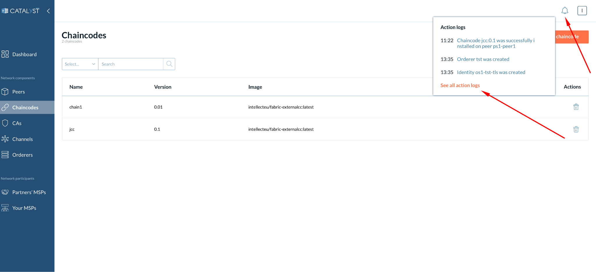
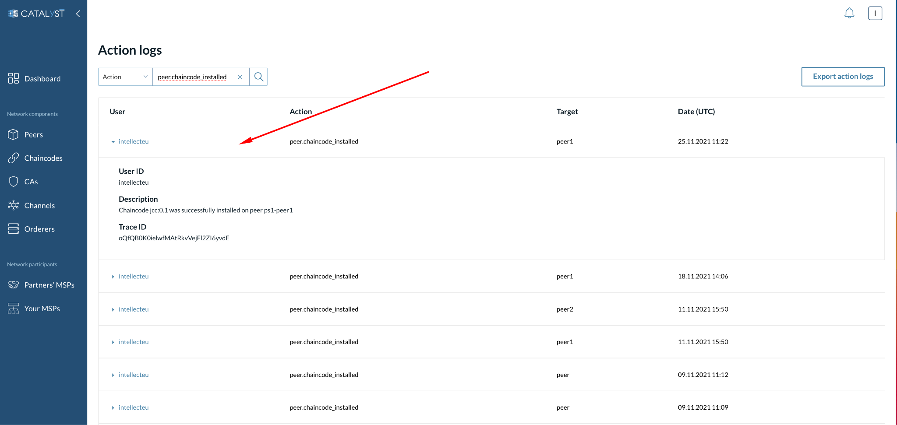
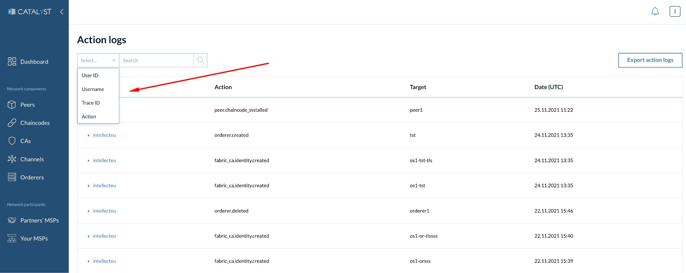

# Action logs

Catalyst Blockchain Platform allows a User to track events related to:\

| **Type**             | **Event**                             | **Action Type**                            |
| -------------------- | ------------------------------------- | ------------------------------------------ |
| **Chaincodes**       |                                       |                                            |
|                      | ChaincodeApproved                     | chaincode.approved                         |
|                      | ChaincodeCommitted                    | chaincode.committed                        |
| **Channels**         |                                       |                                            |
|                      | ChannelCreated                        | channel.created                            |
|                      | ChannelOrganizationAnchorPeersUpdated | channel.organization.anchor\_peers.updated |
|                      | ChannelOrganizationAdded              | channel.organization.added                 |
|                      | ChannelOrganizationDeleted            | channel.consenter.added                    |
|                      | ChannelConsenterAdded                 | channel.consenter.added                    |
|                      | ChannelConsenterDeleted               | channel.consenter.deleted                  |
|                      | ChannelOrderingConfigUpdated          | channel.ordering\_config.updated           |
|                      | ProposalCreated                       | proposal.created                           |
| **Peer Sets**        |                                       |                                            |
|                      | PeerSetCreated                        | peer\_set.created                          |
|                      | PeerSetUpdated                        | peer\_set.updated                          |
|                      | PeerSetDeleted                        | peer\_set.deleted                          |
| **Peers**            |                                       |                                            |
|                      | PeerCreated                           | peer.created                               |
|                      | PeerDeleted                           | peer.deleted                               |
|                      | PeerRestarted                         | peer.restarted                             |
|                      | PeerJoinedChannel                     | peer.joined\_channel                       |
|                      | PeerChaincodeInstalled                | peer.chaincode\_installed                  |
| **CAs**              |                                       |                                            |
|                      | FabricCACreated                       | fabric\_ca.created                         |
|                      | FabricCAUpdated                       | fabric\_ca.updated                         |
|                      | FabricCADeleted                       | fabric\_ca.deleted                         |
|                      | FabricCARestarted                     | fabric\_ca.restarted                       |
| **Identities**       |                                       |                                            |
|                      | IdentityCreated                       | fabric\_ca.identity.created                |
|                      | IdentityDeleted                       | fabric\_ca.identity.deleted                |
|                      | IdentityRegistered                    | fabric\_ca.identity.registered             |
|                      | IdentityEnrolled                      | fabric\_ca.identity.enrolled               |
| **MSPs**             |                                       |                                            |
|                      | MSPCreated                            | msp.created                                |
|                      | MSPImported                           | msp.imported                               |
|                      | MSPUpdated                            | msp.updated                                |
|                      | MSPDeleted                            | msp.deleted                                |
| **Ordering Service** |                                       |                                            |
|                      | OrderingServiceCreated                | ordering\_service.created                  |
|                      | OrderingServiceUpdated                | ordering\_service.updated                  |
|                      | OrderingServiceDeleted                | ordering\_service.deleted                  |
| **Orderers**         |                                       |                                            |
|                      | OrdererCreated                        | orderer.created                            |
|                      | OrdererDeleted                        | orderer.deleted                            |
|                      | OrdererRestarted                      | orderer.restarted                          |

You can see the events by clicking on the bell icon and the “See all action logs” link (see the screenshot below).

At the “Action logs” page, you can find the following information:

* **User** - Who performed an action.
* **Action** - What kind of action was performed.
* **Target** - What object does this event relate to.
* **Date** - When an event appeared (UTC).

Click on a particular item to see details, such as User ID, Description, and Trace ID, which can be further used to track the event in logs of Catalyst Blockchain Platform.

### Search for events

You can search for a particular event by:

* User ID
* Username
* Trace ID
* Action\

### **Export action logs**

This feature is designed to provide information about nodes. You can export the events by clicking the “Export action logs” button. This will download a JSON file with all the events related to nodes creation and deletion.

.png>)
